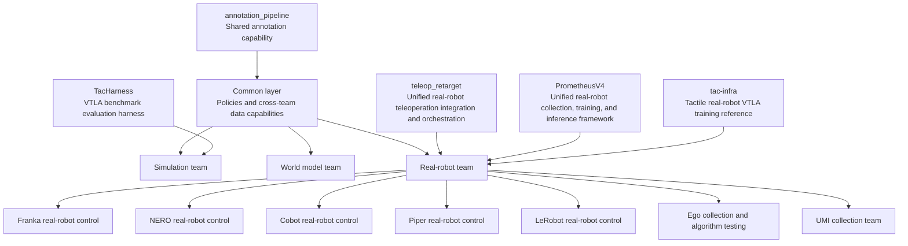

# LV Robotics Lab Repository Guide

## One-Sentence Navigation

Read [`lab-wiki`](https://github.com/LV-Robotics-Lab/lab-wiki) first to understand laboratory policies, then enter the "main entry-point repository" for your team. Device SDKs, paper code, and upstream forks are usually dependencies or references and should not be a new member's first stop.



## Current Organization Inventory

| Metric | 2026-08-16 snapshot | Navigation implication |
| --- | ---: | --- |
| Total repositories | 92 | The list must be layered rather than presented flat |
| Public / Private | 49 / 43 | Public and internal guides must remain separate |
| GitHub-marked non-fork / fork | 54 / 38 | Forks belong in the upstream-reference layer, except for a few deeply customized forks |
| Marked Archived | 0 | Lifecycle labels currently cannot distinguish historical repositories from mainline repositories |
| With Description | 50 | The purpose of 42 repositories cannot be determined from the organization list alone |
| With Topics | 1 | Topics currently cannot be used to filter by team |
| GitHub Teams | 0 | Teams are not yet mapped to GitHub permissions and CODEOWNERS structures |
| Non-fork repositories last pushed before 2026 | 9 | Each must be checked to determine whether it is a historical baseline, an upstream mirror, or still in use |

Note: `pushed_at`, recent import time, passing tests, and the mere existence of a repository do not mean that a project is currently active, works on real hardware, or has validated research results.

### Access Governance Snapshot

| Metric | Verified value on 2026-08-16 |
| --- | ---: |
| Active organization members | 33 (2 Owner / 31 Member) |
| Outside Collaborators | 0 |
| Pending organization member invitations | 2 |
| Pending repository collaborator invitations | 0 (all 92/92 repositories verified) |
| Base repository permission | `write` |

All current repository users are organization members or owners, and there are no Outside Collaborators to remove. The two pending invitations are organization **member** invitations and must be accepted by the invitees; they are not single-repository collaborator invitations. Because the organization base permission remains `write` and no Team exists, a new member receives base write access to every organization repository as soon as the invitation is accepted. Establish Team-to-repository role mappings first, then review lowering the base permission, enforcing 2FA, and disabling ordinary members' ability to invite Outside Collaborators. Do not conflate these governance actions with "removing current Outside Collaborators." Detailed evidence is in `LV-Robotics-Lab-access-audit-2026-08-16.md` in the same directory.

## Four Repository Roles in This Guide

| Role | Meaning | New-member action |
| --- | --- | --- |
| **Main entry point** | Central location for the direction's tasks, architecture, operating method, and validation evidence | Read the README, architecture, and current status first |
| **Device/capability layer** | Responsible for one piece of hardware, data source, protocol, or shared capability | Consume it at a pinned version through the main entry point; do not assemble a system from it independently |
| **Customized upstream** | Forked from upstream but now carries laboratory adaptations | Read the laboratory modification boundary before comparing it with upstream |
| **Reference/governance pending** | Paper code, SDK mirrors, historical experiments, or repositories with an unconfirmed purpose | Treat as read-only by default; confirm the owner and lifecycle before development |

## 0. Common Layer

| Repository | Role | What to understand here |
| --- | --- | --- |
| [`lab-wiki`](https://github.com/LV-Robotics-Lab/lab-wiki) | Main entry point for organization policies, Public | Onboarding, collaboration, data, compute, real-robot safety, and administrative processes. The current public site is not suitable for a complete private-repository inventory |
| [`annotation_pipeline`](https://github.com/LV-Robotics-Lab/annotation_pipeline) | Cross-team shared annotation capability, Private | Independent video-to-episode-caption/subtask-timeline annotation and blind-review contract; it is not owned solely by the world model team |
| [`ClawCross`](https://github.com/LV-Robotics-Lab/ClawCross) | Shared agent tool, Public fork | Multi-agent workflow tooling; it is not the main entry point for a robot runtime stack |

Recommended reading order: `lab-wiki` -> your team's main entry point -> wrappers/submodules referenced by that entry point -> current validation records.

## 1. Simulation Team

### Main Entry Points

| Repository | Position | Boundary |
| --- | --- | --- |
| [`AgenticSim`](https://github.com/LV-Robotics-Lab/AgenticSim) | Team-wide entry point, Private | Robot-for-Robot data, evaluation, and self-improving Physical AI; simulators such as Isaac are integrated through `third_party/` |
| [`robot-harness-gen-env`](https://github.com/LV-Robotics-Lab/robot-harness-gen-env) | Main scene-generation entry point, Public | Text -> deterministic SceneSpec -> RoboTwin/SAPIEN validation; owns the trust boundary for `/gen-env` |
| [`TacHarness`](https://github.com/LV-Robotics-Lab/TacHarness) | VTLA benchmark/evaluation subproject, Private | The simulation team's internal VTLA benchmark evaluation harness; it is neither a lab-wide shared framework nor the real-robot team's entry point |

### Simulation Foundations and Research References

- Scenes/engines: [`SAPIEN`](https://github.com/LV-Robotics-Lab/SAPIEN), [`IsaacLab`](https://github.com/LV-Robotics-Lab/IsaacLab), [`isaacgym`](https://github.com/LV-Robotics-Lab/isaacgym), [`IsaacGymEnvs`](https://github.com/LV-Robotics-Lab/IsaacGymEnvs), [`mjlab`](https://github.com/LV-Robotics-Lab/mjlab), and [`mobile_aloha_sim`](https://github.com/LV-Robotics-Lab/mobile_aloha_sim).
- Real-to-Sim: [`OpenReal2Sim`](https://github.com/LV-Robotics-Lab/OpenReal2Sim), [`digital-cousins`](https://github.com/LV-Robotics-Lab/digital-cousins), and [`HOMIE-toolkit`](https://github.com/LV-Robotics-Lab/HOMIE-toolkit).
- Geometry/differentiable components: [`dex-urdf`](https://github.com/LV-Robotics-Lab/dex-urdf), [`differentiable_robot_hand`](https://github.com/LV-Robotics-Lab/differentiable_robot_hand), [`pytorch_kinematics-default`](https://github.com/LV-Robotics-Lab/pytorch_kinematics-default), [`pytorch3d`](https://github.com/LV-Robotics-Lab/pytorch3d), [`nvdiffrast`](https://github.com/LV-Robotics-Lab/nvdiffrast), [`Pointnet2_PyTorch`](https://github.com/LV-Robotics-Lab/Pointnet2_PyTorch), and [`vnn`](https://github.com/LV-Robotics-Lab/vnn).
- Policy/grasping references: [`UniGraspTransformer`](https://github.com/LV-Robotics-Lab/UniGraspTransformer), external reference [`flow_matching`](https://github.com/zangyujie2004/flow_matching), and [`dcp`](https://github.com/LV-Robotics-Lab/dcp).

The simulation team's key governance action is to treat `AgenticSim` and `robot-harness-gen-env` as the mainline and explicitly label all other repositories as pinned dependencies, paper reproductions, or historical baselines. New members should not have to guess an entry point among 20 engine and algorithm repositories.

## 2. World Model Team

### Main Entry Points

| Repository | Position | Boundary |
| --- | --- | --- |
| [`umi-world-model-lab`](https://github.com/LV-Robotics-Lab/umi-world-model-lab) | Main world model project / Stage 1, Private | Retains core world model training, data/IDM/action conditioning, whole-frame/multiview evaluation, and WMFactory; Stage 2 layered-image world model code is not duplicated after migration |
| [`image-layered-world-model`](https://github.com/LV-Robotics-Lab/image-layered-world-model) | World model Stage 2, Private | Sole location for the image-layered data agent, segmentation/review, VACE/RobotSeg/RevealLayer integration, and reproduction metadata |

`annotation_pipeline` is a common-layer capability. World model projects may consume it, but its use by `umi-world-model-lab` does not make it the exclusive property of the world model team.

`UMI` in this repository name refers to the data form consumed by the world model and the history of the research project. It does not mean the organizational "real-robot UMI collection team." The world model team and the UMI collection team below are separate navigation branches.

The Stage 2 split is complete: the Data Agent, layer core, and cross-repository contract were merged through [`image-layered-world-model` PR #1](https://github.com/LV-Robotics-Lab/image-layered-world-model/pull/1), [PR #2](https://github.com/LV-Robotics-Lab/image-layered-world-model/pull/2), and [PR #3](https://github.com/LV-Robotics-Lab/image-layered-world-model/pull/3), respectively. [`umi-world-model-lab` PR #4](https://github.com/LV-Robotics-Lab/umi-world-model-lab/pull/4) then removed 301 duplicated files already covered elsewhere while retaining UMI training/data/IDM/action, `dualwan-lora`, the multiview benchmark, the aggregate verifier, and the shared `annotation_pipeline` gitlink. The two repositories exchange data only through explicit manifest/data/artifact paths; they no longer vendor each other or fall back to a second Stage 2 implementation.

### Research Reference Shelf

- World models/VLA: [`Ctrl-World`](https://github.com/LV-Robotics-Lab/Ctrl-World), [`DreamDojo`](https://github.com/LV-Robotics-Lab/DreamDojo), [`dreamzero`](https://github.com/LV-Robotics-Lab/dreamzero), external reference [`GoalVLA`](https://github.com/chenhn02/GoalVLA), and [`ManiFM`](https://github.com/LV-Robotics-Lab/ManiFM).
- Layered generation/editing: [`LayerFlow`](https://github.com/LV-Robotics-Lab/LayerFlow), [`RevealLayer`](https://github.com/LV-Robotics-Lab/RevealLayer), [`VACE`](https://github.com/LV-Robotics-Lab/VACE), [`OmniSVG`](https://github.com/LV-Robotics-Lab/OmniSVG), [`star-vector`](https://github.com/LV-Robotics-Lab/star-vector), and [`SuperSVG`](https://github.com/LV-Robotics-Lab/SuperSVG).
- Perception/automatic annotation: [`nils`](https://github.com/LV-Robotics-Lab/nils), external reference [`VLM-Video-Action-Localization`](https://github.com/microsoft/VLM-Video-Action-Localization), [`Grounding-DINO-1.5-API`](https://github.com/LV-Robotics-Lab/Grounding-DINO-1.5-API), [`FoundationPose`](https://github.com/LV-Robotics-Lab/FoundationPose), [`sam3`](https://github.com/LV-Robotics-Lab/sam3), [`segment-anything`](https://github.com/LV-Robotics-Lab/segment-anything), and [`segment-anything-2`](https://github.com/LV-Robotics-Lab/segment-anything-2).

These reference repositories should not be displayed alongside the laboratory mainline. The guide should link backward from the two main entry points to the versions actually pinned today. `flow_matching`, `GoalVLA`, and `VLM-Video-Action-Localization` are outside the organization; they appear only as research reference links and are not counted in the organization inventory or the primary-ownership index in Section 7.

## 3. Shared Real-Robot Structure

### Unified Entry Points

| Repository | Role | Responsibility boundary |
| --- | --- | --- |
| [`teleop_retarget`](https://github.com/LV-Robotics-Lab/teleop_retarget) | Unified real-robot teleoperation integration and orchestration entry point, Private | Integrates master devices and input sources; owns source-to-target mapping, clutch, calibration, and session orchestration. Device lifecycle and final safety gates remain with each wrapper |
| [`PrometheusV4`](https://github.com/LV-Robotics-Lab/PrometheusV4) | Unified real-robot collection, training, and inference framework, customized Private fork | Unifies collection, raw episodes, training, inference, playback, and DAgger; specific hardware is adapted through `hardware/*` branches |

```text
Input device layer       Quest / DataMaster / LinkerTA / MANUS / VIVE / Wuji Glove
                            ↓
System orchestration     teleop_retarget (mapping, clutch, calibration, session)
                            ↓
Robot device layer       franka_wrapper / nero_wrapper / piper_wrapper / ...
                            ↓
Recording and evaluation PrometheusV4 native recorder / per-project collection devices and data stacks
```

Principle: input wrappers do not command robots; `teleop_retarget` does not take over device lifecycle; robot wrappers retain the final safety boundary for feedback, limits, faults, and motion authorization.

### Shared Tactile VTLA Training Reference

| Repository | Role | Usage boundary |
| --- | --- | --- |
| [`tac-infra`](https://github.com/LV-Robotics-Lab/tac-infra) | VTLA training infrastructure reference for every real-robot project using touch, Private | Provides tactile-MAE backbone pretraining and training/deployment references for VTLA policies including ACT, diffusion, Pi0.5, and StarVLA-GROOT; it is not exclusive to the UMI collection team and does not replace each project's data contract, hardware safety gates, or runtime entry point |

### 3.1 Franka Real-Robot Control

| Priority | Repository | Purpose |
| --- | --- | --- |
| System entry point | [`PrometheusV4`](https://github.com/LV-Robotics-Lab/PrometheusV4/tree/hardware/franka-wuji) `hardware/franka-wuji` | Native Franka/Wuji collection, `prometheus_raw_episode_v1`, training, playback, and operator workflow |
| Device layer | [`franka_wrapper`](https://github.com/LV-Robotics-Lab/franka_wrapper) | FR3, libfranka/franka_ros2, GELLO, and real-time control boundary |
| System integration | [`teleop_retarget`](https://github.com/LV-Robotics-Lab/teleop_retarget) | `vive-manus-franka-wuji` route, cross-device calibration, and orchestration |
| Input devices | [`dexgello_wrapper`](https://github.com/LV-Robotics-Lab/dexgello_wrapper), [`manus_wrapper`](https://github.com/LV-Robotics-Lab/manus_wrapper), [`vive_wrapper`](https://github.com/LV-Robotics-Lab/vive_wrapper), and [`wuji_glove_wrapper`](https://github.com/LV-Robotics-Lab/wuji_glove_wrapper) | GELLO, glove, tracker, and tactile inputs |
| End effector | [`wuji_wrapper`](https://github.com/LV-Robotics-Lab/wuji_wrapper) | Wuji Hand SDK, ROS2, models, simulation, and unified wrapper |
| Upstream reference | [`wuji-hand-teleop`](https://github.com/LV-Robotics-Lab/wuji-hand-teleop) and [`wuji-retargeting`](https://github.com/LV-Robotics-Lab/wuji-retargeting) | Vendor/upstream teleoperation and retargeting baselines |

The runtime functionality of the former standalone `real_robot_record` repository has been absorbed by this branch, and the repository was deleted on 2026-08-15. Its historical bundle is only for recovery and legacy investigation and is no longer a runtime dependency.

### 3.2 NERO Real-Robot Control

| Priority | Repository | Purpose |
| --- | --- | --- |
| Main entry point | [`nero_wrapper`](https://github.com/LV-Robotics-Lab/nero_wrapper) | Configuration, diagnostics, safety gates, and on-site operational entry point for the AgileX NERO dual-arm system |
| System integration | [`teleop_retarget`](https://github.com/LV-Robotics-Lab/teleop_retarget) | DataMaster-to-NERO/TacClaw mapping and session orchestration |
| Input | [`datamaster_wrapper`](https://github.com/LV-Robotics-Lab/datamaster_wrapper) | Responsible only for DataMaster messages, lifecycle, and freshness diagnostics |
| End effector | [`tacclaw_wrapper`](https://github.com/LV-Robotics-Lab/tacclaw_wrapper) | TacClaw execution boundary |
| Historical workspace | [`agilex_ws`](https://github.com/LV-Robotics-Lab/agilex_ws) | ROS/catkin workspace without a README; `nero_wrapper` documentation should explain why it is retained and how versions relate |

The primary ownership of `linkerhand_wrapper` is Piper. Historical or cross-team experimental references retained in NERO indicate only a consumer relationship and do not reassign LinkerHand to the NERO device layer.

### 3.3 Cobot Real-Robot Control

| Priority | Repository | Purpose |
| --- | --- | --- |
| Runtime/data entry point | [`PrometheusV4`](https://github.com/LV-Robotics-Lab/PrometheusV4) | Consumer of Cobot runtime, collection, and configuration; a deeply customized fork |
| Robot workspace | [`cobot_magic`](https://github.com/LV-Robotics-Lab/cobot_magic) | Combined Piper/ALOHA/camera/collection workspace; currently lacks a README and urgently needs entry-point documentation |
| Touch | [`dmtacx_wrapper`](https://github.com/LV-Robotics-Lab/dmtacx_wrapper) | Explicit device selection, UVC lifecycle, and evidence output for DM-Tac X |
| Thermal imaging | [`iray_capturer`](https://github.com/LV-Robotics-Lab/iray_capturer) | iRay thermal and optional RGB-D capture |
| LiDAR references | [`Livox-SDK2`](https://github.com/LV-Robotics-Lab/Livox-SDK2), [`livox_ros_driver2`](https://github.com/LV-Robotics-Lab/livox_ros_driver2), and [`rslidar_sdk`](https://github.com/LV-Robotics-Lab/rslidar_sdk) | Vendor SDK/ROS driver mirrors, not the main Cobot project entry point |

### 3.4 Piper Real-Robot Control

| Priority | Repository | Purpose |
| --- | --- | --- |
| Main entry point | [`piper_wrapper`](https://github.com/LV-Robotics-Lab/piper_wrapper) | PIPER SDK, ROS2, MuJoCo, state, and fail-closed execution boundary |
| System integration | [`teleop_retarget`](https://github.com/LV-Robotics-Lab/teleop_retarget) | LinkerTA/FFG-to-PIPER/LinkerHand mapping and session orchestration |
| Master inputs | [`linker_ta`](https://github.com/LV-Robotics-Lab/linker_ta) and [`linker_ffg`](https://github.com/LV-Robotics-Lab/linker_ffg) | Dual-arm master device and force-feedback glove, read-only input and readiness gate |
| End effector | [`linkerhand_wrapper`](https://github.com/LV-Robotics-Lab/linkerhand_wrapper) | Device integration, safety gates, diagnostics, and gesture control for dual LinkerHand L6 units installed on Piper; retains compatibility with upstream `LinkerHand` / `linker_hand_l6` Python APIs |
| Historical/vendor layer | [`piper_sdk`](https://github.com/LV-Robotics-Lab/piper_sdk), [`piper_sdk_demo`](https://github.com/LV-Robotics-Lab/piper_sdk_demo), and [`Piper_ros_private-ros-noetic`](https://github.com/LV-Robotics-Lab/Piper_ros_private-ros-noetic) | Pinned by `piper_wrapper` or `cobot_magic`; not an independent entry point for new development |
| Mobile base | [`tracer_ros`](https://github.com/LV-Robotics-Lab/tracer_ros) | Historical ROS/CMake component; current owner and use case require confirmation |

The identity of `linkerhand_wrapper` is aligned with other device wrappers, while its pinned upstream SDK directory and import API are retained internally to avoid pointless consumer breakage. `teleop_retarget` now pins the safety-fixed wrapper from its new URL. Public configurations do not store sudo passwords, device serial numbers, or single-device fault records. Any on-site host that has ever retained a vendor-published default sudo password must rotate it separately.

### 3.5 LeRobot Real-Robot Control

| Priority | Repository | Purpose |
| --- | --- | --- |
| Framework entry point | [`lerobot`](https://github.com/LV-Robotics-Lab/lerobot) | Laboratory-customized LeRobot fork carrying RealMan, uGripper, tactile, AmazingHand, and other integrations |
| Device wrappers | [`amazinghand_wrapper`](https://github.com/LV-Robotics-Lab/amazinghand_wrapper), [`arx_wrapper`](https://github.com/LV-Robotics-Lab/arx_wrapper), and [`yam_wrapper`](https://github.com/LV-Robotics-Lab/yam_wrapper) | Device and safety boundaries for AmazingHand, ARX A5, and YAM/Flow Base |
| Policy baseline | [`openpi`](https://github.com/LV-Robotics-Lab/openpi) | Upstream Pi0 fork/policy runtime reference; the laboratory attention audit has converged into the isolated `tools/pi0_attention_audit`, while each project still declares its specific policy pin |
| ROS/vendor references | [`engineai_ros2_workspace`](https://github.com/LV-Robotics-Lab/engineai_ros2_workspace), [`xArm-Python-SDK`](https://github.com/LV-Robotics-Lab/xArm-Python-SDK), [`LEAP_Hand_API`](https://github.com/LV-Robotics-Lab/LEAP_Hand_API), and [`librealsense`](https://github.com/LV-Robotics-Lab/librealsense) | Upstream dependencies and hardware SDKs, not project entry points within the team |
| Historical projects | [`xarm6`](https://github.com/LV-Robotics-Lab/xarm6), [`xarm7`](https://github.com/LV-Robotics-Lab/xarm7), and [`realworld`](https://github.com/LV-Robotics-Lab/realworld) | Calibration/motion-planning/old real-world stacks; confirm whether to migrate, archive, or continue maintaining them |

### 3.6 Ego Collection and Algorithm Testing

| Priority | Repository | Purpose |
| --- | --- | --- |
| Headset input | [`quest_streamer`](https://github.com/LV-Robotics-Lab/quest_streamer) | Quest controller, hand-tracking, and passthrough-camera data source |
| Wearable spatial tracking | [`vive_wrapper`](https://github.com/LV-Robotics-Lab/vive_wrapper) | VIVE Tracker wrist/object/body pose data source, usable for spatial tracking of wrists, objects, and bodies during Ego collection |
| Wearable hand sensing | [`manus_wrapper`](https://github.com/LV-Robotics-Lab/manus_wrapper) | MANUS Quantum Metaglove Pro finger-pose data source, usable for dual-hand skeleton/finger-pose input during Ego collection |
| Perception references | [`segment-anything-2-real-time`](https://github.com/LV-Robotics-Lab/segment-anything-2-real-time) and [`whole_body_tracking`](https://github.com/LV-Robotics-Lab/whole_body_tracking) | Upstream references for real-time segmentation and whole-body tracking |
| Wearable input | [`udcap_glove`](https://github.com/LV-Robotics-Lab/udcap_glove) | Historical glove software; owner, protocol, and current status must be documented |

`vive_wrapper` and `manus_wrapper` may also be consumed by Franka and other real-robot routes. They are placed under Ego because of their primary navigation responsibility as wearable collection sensors, not because only Ego may use them.

### 3.7 UMI Collection Team

| Priority | Repository | Purpose |
| --- | --- | --- |
| Main device-collection entry point | [`dataclaw_wrapper`](https://github.com/LV-Robotics-Lab/dataclaw_wrapper) | DataClaw/TacUMI collection-device and data-adaptation boundary for the UMI team; supports v1 dual-USB-drive imports and v2 network backpacks, and is not responsible for TacClaw execution |

The UMI collection team currently centers on the `dataclaw_wrapper` device-collection path. `umi-world-model-lab` and `image-layered-world-model` belong to the world model team; `annotation_pipeline` belongs to the common layer; and `tac-infra` is a training-infrastructure reference for every tactile real-robot project. None of these four belongs under the UMI collection team.

## 4. Unowned, Archival, or Reclassification Candidates

The following repositories should not appear alongside the current mainline on the guide's home page. Confirm the owner, paper/project status, unique data, and recoverability before deciding whether to archive, migrate, or retain them:

- [`BiMo`](https://github.com/LV-Robotics-Lab/BiMo): the README still records a personal absolute path, and the last push was in 2025.
- [`DexSinGrasp-rw`](https://github.com/LV-Robotics-Lab/DexSinGrasp-rw): large research codebase; confirm whether it is a paper reproduction or a current experiment.
- [`MetaFold-rw`](https://github.com/LV-Robotics-Lab/MetaFold-rw): large research repository without an organization-level description.
- [`tiebot`](https://github.com/LV-Robotics-Lab/tiebot): the README says only "tie a knot," so the owner, runtime entry point, and evidence cannot be determined.
- [`vnn`](https://github.com/LV-Robotics-Lab/vnn): Vector Neurons source is embedded; clarify whether it is a vendored dependency or an independently maintained repository.

Completed retirements: `real_robot_record` (functionality absorbed by the native Prometheus implementation), `pi0-attention-audit` (sanitized maintenance code merged into [`openpi/tools/pi0_attention_audit`](https://github.com/LV-Robotics-Lab/openpi/tree/main/tools/pi0_attention_audit)), and the organization fork `LVLab-SMU.github.io` (`ahead_by=0` relative to upstream with no unique remote assets) were all deleted on 2026-08-15. Complete histories and remote assets for the first two repositories were backed up and verified.

`demo-repository` was also deleted on 2026-08-16. It contained only GitHub example templates and an old badge PR, with no laboratory-specific code, data, or downstream dependency. Before deletion, its complete Git history, PR refs, GitHub Pages, and deployment metadata were backed up and verified through bundle restoration and checksums.

Before deleting any repository, still check unique commits, Releases, Git LFS, Packages, Actions artifacts, submodule references, private forks, ignored/local data, and backups. Being "old" or having "no README" is not by itself a reason to delete a repository.

## 5. Recommended GitHub Information Architecture

### Team Hierarchy

```text
lv-robotics-lab
├── common-maintainers
├── simulation
├── world-model
└── real-robot
    ├── franka
    ├── nero
    ├── cobot
    ├── piper
    ├── lerobot
    ├── ego
    └── umi-collection
```

GitHub nested teams can represent parent-child groups and inherit repository permissions. Repositories should still receive `Read / Triage / Write / Maintain / Admin` under least privilege; do not use organization owner as a routine collaboration role.

### Recommended Repository Custom Properties

Compared with free-text topics, organization-level custom properties are better suited as the sole queryable and governable classification source:

| Property | Recommended values |
| --- | --- |
| `owner_group` | `common` / `simulation` / `world-model` / `real-franka` / `real-nero` / `real-cobot` / `real-piper` / `real-lerobot` / `real-ego` / `real-umi-collection` |
| `repo_role` | `entrypoint` / `device-wrapper` / `integration` / `data` / `evaluation` / `upstream-reference` / `legacy` |
| `lifecycle` | `active` / `maintenance` / `experimental` / `review-needed` / `archived` |
| `evidence_level` | `source-only` / `offline-tested` / `sim-validated` / `hardware-validated` / `research-validated` |
| `data_class` | `public` / `internal-code` / `restricted-data` / `no-data` |

GitHub's official documentation explains that custom properties support organization-wide search, filtering, and ruleset targeting, and that property visibility follows repository visibility: [Managing custom properties](https://docs.github.com/en/organizations/managing-organization-settings/managing-custom-properties-for-repositories-in-your-organization).

### Standard First Screen for Each Entry-Point README

The first 30 lines of every main entry-point repository should contain:

1. A one-sentence purpose and owning team.
2. Its `main-entry / wrapper / integration / upstream-reference` role.
3. "Responsible / not responsible" boundaries with adjacent repositories.
4. Current evidence level: source, offline, simulation, real hardware, or research results.
5. The first read-only command for a new member and a complete documentation map.
6. Git boundaries for data, checkpoints, calibration, credentials, and generated artifacts.
7. Current maintainer and last verification date.

## 6. Complete Repository Ownership Index

This index gives each of the current 92 organization repositories one "primary ownership" assignment. Cross-team consumer relationships follow the body above. External research references are linked only in the body and do not enter this index.

| Primary ownership | Repositories |
| --- | --- |
| Common | `lab-wiki`, `annotation_pipeline`, `ClawCross` |
| Shared real-robot | `teleop_retarget`, `PrometheusV4`, `tac-infra` |
| Simulation | `AgenticSim`, `robot-harness-gen-env`, `TacHarness`, `mobile_aloha_sim`, `SAPIEN`, `isaacgym`, `IsaacGymEnvs`, `IsaacLab`, `mjlab`, `digital-cousins`, `OpenReal2Sim`, `HOMIE-toolkit`, `dex-urdf`, `differentiable_robot_hand`, `nvdiffrast`, `pytorch3d`, `Pointnet2_PyTorch`, `UniGraspTransformer`, `dcp`, `pytorch_kinematics-default` |
| World model | `umi-world-model-lab`, `image-layered-world-model`, `Ctrl-World`, `DreamDojo`, `dreamzero`, `LayerFlow`, `RevealLayer`, `VACE`, `nils`, `Grounding-DINO-1.5-API`, `sam3`, `segment-anything`, `segment-anything-2`, `OmniSVG`, `star-vector`, `SuperSVG`, `FoundationPose`, `ManiFM` |
| Franka | `franka_wrapper`, `dexgello_wrapper`, `wuji_wrapper`, `wuji_glove_wrapper`, `wuji-hand-teleop`, `wuji-retargeting` |
| NERO | `nero_wrapper`, `agilex_ws`, `datamaster_wrapper`, `tacclaw_wrapper` |
| Cobot | `cobot_magic`, `dmtacx_wrapper`, `iray_capturer`, `Livox-SDK2`, `livox_ros_driver2`, `rslidar_sdk` |
| Piper | `piper_wrapper`, `linkerhand_wrapper`, `piper_sdk`, `piper_sdk_demo`, `Piper_ros_private-ros-noetic`, `linker_ta`, `linker_ffg`, `tracer_ros` |
| LeRobot | `lerobot`, `amazinghand_wrapper`, `arx_wrapper`, `yam_wrapper`, `engineai_ros2_workspace`, `xArm-Python-SDK`, `xarm6`, `xarm7`, `realworld`, `LEAP_Hand_API`, `librealsense`, `openpi` |
| Ego | `quest_streamer`, `vive_wrapper`, `manus_wrapper`, `segment-anything-2-real-time`, `whole_body_tracking`, `udcap_glove` |
| UMI collection | `dataclaw_wrapper` |
| Governance pending | `BiMo`, `DexSinGrasp-rw`, `MetaFold-rw`, `tiebot`, `vnn` |

## Maintenance Rules

- Organization repositories, visibility, fork status, update time, and validation status are dynamic. Generate an inventory diff at least monthly, and have team leads review entry points and lifecycles quarterly.
- "Primary ownership" on this page is a navigation responsibility; it does not mean that only one team may use a repository.
- When creating a repository, also provide the owning team, description, custom properties, README boundaries, CODEOWNERS, and data classification.
- Real-robot repositories must record offline tests, simulation, calibration, low-speed hardware validation, and production collection separately.
- Public repositories contain only approved information; private repository names and internal architecture may also be non-public information.

## Maintenance

- Maintainer: Wiki Team
- Last verified: 2026-08-16
