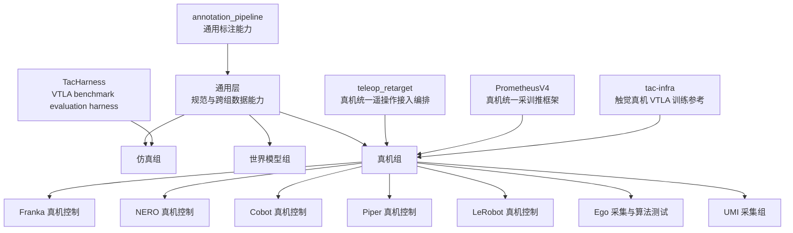

# LV Robotics Lab 仓库导览

## 一句话导航

先读 [`lab-wiki`](https://github.com/LV-Robotics-Lab/lab-wiki) 了解实验室规范，再进入所在组的“主入口仓库”；设备 SDK、论文代码和上游 fork 通常只是依赖或参考，不应成为新成员的第一站。



## 当前组织盘点

| 指标 | 2026-08-16 快照 | 导览含义 |
| --- | ---: | --- |
| 仓库总数 | 92 | 必须分层，不能平铺展示 |
| Public / Private | 49 / 43 | 公开导览和内部导览必须分开 |
| GitHub 标记的非 fork / fork | 54 / 38 | fork 应进入“上游参考层”，少数深度定制 fork 例外 |
| 已标记 Archived | 0 | 历史仓库和主线仓库目前无法靠生命周期标记区分 |
| 有 Description | 50 | 42 个仓库仅看组织列表无法判断用途 |
| 有 Topics | 1 | 目前无法靠 topic 按组筛选 |
| GitHub Teams | 0 | 组别尚未映射为 GitHub 权限与 CODEOWNERS 结构 |
| 2026 年前最后推送的非 fork 仓库 | 9 | 需要逐个确认是历史基线、上游镜像还是仍在使用 |

注意：`pushed_at`、最近导入时间、测试通过和仓库存在都不等于当前项目活跃、真机可用或研究结果已验证。

### 访问治理快照

| 指标 | 2026-08-16 核验值 |
| --- | ---: |
| Active organization members | 33（2 Owner / 31 Member） |
| Outside Collaborators | 0 |
| Pending organization member invitations | 2 |
| Pending repository collaborator invitations | 0（92/92 仓已核验） |
| Base repository permission | `write` |

当前所有仓库访问者都是组织 member/owner，没有需要删除的 Outside Collaborator。两条待处理邀请是组织 **member** 邀请，必须由受邀者接受；它们不是单仓 collaborator 邀请。由于组织基础权限仍是 `write` 且尚无 Team，新成员一旦接受邀请就会获得全部组织仓库的基础写权限。应先建立 Team 与仓库角色映射，再评审降低基础权限、强制 2FA 和关闭普通成员邀请 Outside Collaborator 的能力；不要把这些治理动作与“删除当前 Outside Collaborator”混为一谈。详细证据见同目录的 `LV-Robotics-Lab-access-audit-2026-08-16.md`。

## 导览中的四种仓库角色

| 角色 | 含义 | 新成员动作 |
| --- | --- | --- |
| **主入口** | 该方向的任务、架构、运行方式和验证证据集中地 | 先读 README、架构和当前状态 |
| **设备/能力层** | 只负责一种硬件、数据源、协议或共用能力 | 由主入口按固定版本引用，不单独拼系统 |
| **定制上游** | fork 自上游，但已承载实验室适配 | 先读本实验室修改边界，再对照 upstream |
| **参考/待治理** | 论文代码、SDK 镜像、历史实验或用途待确认 | 默认只读；确认 owner 和生命周期后再开发 |

## 0. 通用层

| 仓库 | 角色 | 应该从这里理解什么 |
| --- | --- | --- |
| [`lab-wiki`](https://github.com/LV-Robotics-Lab/lab-wiki) | 组织规范主入口，Public | 入组、协作、数据、算力、真机安全和行政流程。当前公开站点不适合承载完整私有仓库清单 |
| [`annotation_pipeline`](https://github.com/LV-Robotics-Lab/annotation_pipeline) | 跨组通用标注能力，Private | 视频到 episode caption / subtask timeline 的独立标注与盲评契约，不归属于世界模型组单独所有 |
| [`ClawCross`](https://github.com/LV-Robotics-Lab/ClawCross) | 通用 agent 工具，Public fork | 多 agent 工作流工具；不是机器人运行栈主入口 |

推荐阅读顺序：`lab-wiki` → 所在组主入口 → 被主入口引用的 wrapper / submodule → 当前验证记录。

## 1. 仿真组

### 主线入口

| 仓库 | 位置 | 边界 |
| --- | --- | --- |
| [`AgenticSim`](https://github.com/LV-Robotics-Lab/AgenticSim) | 组内总入口，Private | Robot-for-Robot 数据、评测与自改进 Physical AI；Isaac 等仿真器通过 `third_party/` 接入 |
| [`robot-harness-gen-env`](https://github.com/LV-Robotics-Lab/robot-harness-gen-env) | 场景生成主入口，Public | 文本→确定性 SceneSpec→RoboTwin/SAPIEN 验证；负责 `/gen-env` 的可信边界 |
| [`TacHarness`](https://github.com/LV-Robotics-Lab/TacHarness) | VTLA benchmark/evaluation 子项目，Private | 仿真组内部的 VTLA benchmark evaluation harness；不是全实验室通用框架，也不是真机组主入口 |

### 仿真基础与研究参考

- 场景/引擎：[`SAPIEN`](https://github.com/LV-Robotics-Lab/SAPIEN)、[`IsaacLab`](https://github.com/LV-Robotics-Lab/IsaacLab)、[`isaacgym`](https://github.com/LV-Robotics-Lab/isaacgym)、[`IsaacGymEnvs`](https://github.com/LV-Robotics-Lab/IsaacGymEnvs)、[`mjlab`](https://github.com/LV-Robotics-Lab/mjlab)、[`mobile_aloha_sim`](https://github.com/LV-Robotics-Lab/mobile_aloha_sim)。
- Real-to-Sim：[`OpenReal2Sim`](https://github.com/LV-Robotics-Lab/OpenReal2Sim)、[`digital-cousins`](https://github.com/LV-Robotics-Lab/digital-cousins)、[`HOMIE-toolkit`](https://github.com/LV-Robotics-Lab/HOMIE-toolkit)。
- 几何/可微分组件：[`dex-urdf`](https://github.com/LV-Robotics-Lab/dex-urdf)、[`differentiable_robot_hand`](https://github.com/LV-Robotics-Lab/differentiable_robot_hand)、[`pytorch_kinematics-default`](https://github.com/LV-Robotics-Lab/pytorch_kinematics-default)、[`pytorch3d`](https://github.com/LV-Robotics-Lab/pytorch3d)、[`nvdiffrast`](https://github.com/LV-Robotics-Lab/nvdiffrast)、[`Pointnet2_PyTorch`](https://github.com/LV-Robotics-Lab/Pointnet2_PyTorch)、[`vnn`](https://github.com/LV-Robotics-Lab/vnn)。
- 策略/抓取参考：[`UniGraspTransformer`](https://github.com/LV-Robotics-Lab/UniGraspTransformer)、外部参考 [`flow_matching`](https://github.com/zangyujie2004/flow_matching)、[`dcp`](https://github.com/LV-Robotics-Lab/dcp)。

仿真组的关键治理动作是：以 `AgenticSim` 和 `robot-harness-gen-env` 为主线，把其余仓库明确标为“固定依赖”“论文复现”或“历史基线”，避免新成员从 20 个引擎/算法仓库中自行猜入口。

## 2. 世界模型组

### 主线入口

| 仓库 | 位置 | 边界 |
| --- | --- | --- |
| [`umi-world-model-lab`](https://github.com/LV-Robotics-Lab/umi-world-model-lab) | 世界模型主项目 / Stage 1，Private | 保留世界模型主训练、数据/IDM/action conditioning、whole-frame/multiview 评测和 WMFactory；Stage 2 分层图像世界模型代码迁出后不再重复维护 |
| [`image-layered-world-model`](https://github.com/LV-Robotics-Lab/image-layered-world-model) | 世界模型 Stage 2，Private | 唯一承载 image-layered data agent、分割/审阅、VACE/RobotSeg/RevealLayer 集成及复现元数据 |

`annotation_pipeline` 是通用层能力。世界模型项目可以消费它，但它不因被 `umi-world-model-lab` 引用而归属于世界模型组。

这里仓库名中的 `UMI` 表示世界模型所消费的数据形态和研究项目沿革，不表示组织上的“真机 UMI 采集组”。世界模型组与下文的 UMI 采集组是两个独立导航分支。

Stage 2 拆分已完成：Data Agent、layer core 和跨仓契约分别经 [`image-layered-world-model` PR #1](https://github.com/LV-Robotics-Lab/image-layered-world-model/pull/1)、[PR #2](https://github.com/LV-Robotics-Lab/image-layered-world-model/pull/2) 和 [PR #3](https://github.com/LV-Robotics-Lab/image-layered-world-model/pull/3) 合入。随后 [`umi-world-model-lab` PR #4](https://github.com/LV-Robotics-Lab/umi-world-model-lab/pull/4) 删除了已覆盖的 301 个重复文件，保留 UMI 训练/数据/IDM/action、`dualwan-lora`、multiview benchmark、aggregate verifier 和通用 `annotation_pipeline` gitlink。两仓只通过显式 manifest/data/artifact 路径交接，不再互相 vendor 或回退到第二份 Stage 2 实现。

### 研究参考架

- 世界模型/VLA：[`Ctrl-World`](https://github.com/LV-Robotics-Lab/Ctrl-World)、[`DreamDojo`](https://github.com/LV-Robotics-Lab/DreamDojo)、[`dreamzero`](https://github.com/LV-Robotics-Lab/dreamzero)、外部参考 [`GoalVLA`](https://github.com/chenhn02/GoalVLA)、[`ManiFM`](https://github.com/LV-Robotics-Lab/ManiFM)。
- 分层生成/编辑：[`LayerFlow`](https://github.com/LV-Robotics-Lab/LayerFlow)、[`RevealLayer`](https://github.com/LV-Robotics-Lab/RevealLayer)、[`VACE`](https://github.com/LV-Robotics-Lab/VACE)、[`OmniSVG`](https://github.com/LV-Robotics-Lab/OmniSVG)、[`star-vector`](https://github.com/LV-Robotics-Lab/star-vector)、[`SuperSVG`](https://github.com/LV-Robotics-Lab/SuperSVG)。
- 感知/自动标注：[`nils`](https://github.com/LV-Robotics-Lab/nils)、外部参考 [`VLM-Video-Action-Localization`](https://github.com/microsoft/VLM-Video-Action-Localization)、[`Grounding-DINO-1.5-API`](https://github.com/LV-Robotics-Lab/Grounding-DINO-1.5-API)、[`FoundationPose`](https://github.com/LV-Robotics-Lab/FoundationPose)、[`sam3`](https://github.com/LV-Robotics-Lab/sam3)、[`segment-anything`](https://github.com/LV-Robotics-Lab/segment-anything)、[`segment-anything-2`](https://github.com/LV-Robotics-Lab/segment-anything-2)。

这些参考仓库不应与实验室主线并列展示；导览应从两个主入口反向链接“当前真正 pin 的版本”。其中 `flow_matching`、`GoalVLA` 和 `VLM-Video-Action-Localization` 位于组织外部，只作为研究参考链接，不计入本文的组织仓库盘点和第 7 节主归属索引。

## 3. 真机组通用分层

### 统一入口

| 仓库 | 角色 | 负责边界 |
| --- | --- | --- |
| [`teleop_retarget`](https://github.com/LV-Robotics-Lab/teleop_retarget) | 真机组统一遥操作接入编排入口，Private | 统一接入各种主端和输入设备，负责 source→target 映射、clutch、标定与会话编排；设备生命周期和最终安全门仍归各 wrapper |
| [`PrometheusV4`](https://github.com/LV-Robotics-Lab/PrometheusV4) | 真机组统一采训推框架，Private 定制 fork | 统一采集、raw episode、训练、推理、回放和 DAgger；具体硬件通过 `hardware/*` 分支适配 |

```text
输入设备层       Quest / DataMaster / LinkerTA / MANUS / VIVE / Wuji Glove
                    ↓
系统编排层       teleop_retarget（映射、clutch、标定、会话）
                    ↓
机器人设备层     franka_wrapper / nero_wrapper / piper_wrapper / ...
                    ↓
记录与评测层     PrometheusV4 原生 recorder / 各项目采集设备与数据栈
```

原则：输入 wrapper 不命令机器人；`teleop_retarget` 不接管设备生命周期；机器人 wrapper 保留反馈、限位、故障和运动授权的最终安全边界。

### 触觉 VTLA 共用训练参考

| 仓库 | 角色 | 使用边界 |
| --- | --- | --- |
| [`tac-infra`](https://github.com/LV-Robotics-Lab/tac-infra) | 所有使用触觉的真机项目可参考的 VTLA 训练 infra，Private | 提供 tactile-MAE backbone 预训练、ACT / diffusion / Pi0.5 / StarVLA-GROOT 等 VTLA 策略训练与部署参考；它不归 UMI 采集组独占，也不取代各项目自己的数据合同、硬件安全门和运行入口 |

### 3.1 Franka 真机控制

| 优先级 | 仓库 | 用途 |
| --- | --- | --- |
| 系统主入口 | [`PrometheusV4`](https://github.com/LV-Robotics-Lab/PrometheusV4/tree/hardware/franka-wuji) `hardware/franka-wuji` | Franka/Wuji 原生采集、`prometheus_raw_episode_v1`、训练、回放和 operator workflow |
| 设备层 | [`franka_wrapper`](https://github.com/LV-Robotics-Lab/franka_wrapper) | FR3、libfranka/franka_ros2、GELLO 和实时控制边界 |
| 系统组合 | [`teleop_retarget`](https://github.com/LV-Robotics-Lab/teleop_retarget) | `vive-manus-franka-wuji` 路线，跨设备标定与编排 |
| 输入设备 | [`dexgello_wrapper`](https://github.com/LV-Robotics-Lab/dexgello_wrapper)、[`manus_wrapper`](https://github.com/LV-Robotics-Lab/manus_wrapper)、[`vive_wrapper`](https://github.com/LV-Robotics-Lab/vive_wrapper)、[`wuji_glove_wrapper`](https://github.com/LV-Robotics-Lab/wuji_glove_wrapper) | GELLO、手套、追踪器和触觉输入 |
| 末端执行器 | [`wuji_wrapper`](https://github.com/LV-Robotics-Lab/wuji_wrapper) | Wuji Hand SDK、ROS2、模型、仿真与统一 wrapper |
| 上游参考 | [`wuji-hand-teleop`](https://github.com/LV-Robotics-Lab/wuji-hand-teleop)、[`wuji-retargeting`](https://github.com/LV-Robotics-Lab/wuji-retargeting) | 厂商/上游遥操作与 retargeting 基线 |

原独立仓库 `real_robot_record` 的运行功能已由本分支吸收，并于 2026-08-15 删除；历史 bundle 只用于恢复和 legacy 查证，不再作为运行依赖。

### 3.2 NERO 真机控制

| 优先级 | 仓库 | 用途 |
| --- | --- | --- |
| 主入口 | [`nero_wrapper`](https://github.com/LV-Robotics-Lab/nero_wrapper) | AgileX NERO 双臂的配置、诊断、安全门和现场操作入口 |
| 系统组合 | [`teleop_retarget`](https://github.com/LV-Robotics-Lab/teleop_retarget) | DataMaster→NERO/TacClaw 的映射与会话编排 |
| 输入 | [`datamaster_wrapper`](https://github.com/LV-Robotics-Lab/datamaster_wrapper) | 只负责 DataMaster 消息、生命周期和新鲜度诊断 |
| 末端 | [`tacclaw_wrapper`](https://github.com/LV-Robotics-Lab/tacclaw_wrapper) | TacClaw 执行边界 |
| 历史工作区 | [`agilex_ws`](https://github.com/LV-Robotics-Lab/agilex_ws) | 无 README 的 ROS/catkin 工作区；应由 `nero_wrapper` 文档明确其保留原因和版本关系 |

`linkerhand_wrapper` 的主归属是 Piper。NERO 中保留的历史或跨组实验引用只表示消费者关系，不把 LinkerHand 重新归入 NERO 的设备层。

### 3.3 Cobot 真机控制

| 优先级 | 仓库 | 用途 |
| --- | --- | --- |
| 运行/数据入口 | [`PrometheusV4`](https://github.com/LV-Robotics-Lab/PrometheusV4) | Cobot 运行、采集和配置消费者；属于深度定制 fork |
| 机器人工作区 | [`cobot_magic`](https://github.com/LV-Robotics-Lab/cobot_magic) | Piper/ALOHA/camera/collection 的综合工作区；当前缺 README，急需补入口文档 |
| 触觉 | [`dmtacx_wrapper`](https://github.com/LV-Robotics-Lab/dmtacx_wrapper) | DM-Tac X 的显式设备选择、UVC 生命周期与证据输出 |
| 热成像 | [`iray_capturer`](https://github.com/LV-Robotics-Lab/iray_capturer) | iRay thermal 与可选 RGB-D 采集 |
| 激光雷达参考 | [`Livox-SDK2`](https://github.com/LV-Robotics-Lab/Livox-SDK2)、[`livox_ros_driver2`](https://github.com/LV-Robotics-Lab/livox_ros_driver2)、[`rslidar_sdk`](https://github.com/LV-Robotics-Lab/rslidar_sdk) | 厂商 SDK/ROS 驱动镜像，不是 Cobot 项目主入口 |

### 3.4 Piper 真机控制

| 优先级 | 仓库 | 用途 |
| --- | --- | --- |
| 主入口 | [`piper_wrapper`](https://github.com/LV-Robotics-Lab/piper_wrapper) | PIPER SDK、ROS2、MuJoCo、状态和 fail-closed 执行边界 |
| 系统组合 | [`teleop_retarget`](https://github.com/LV-Robotics-Lab/teleop_retarget) | LinkerTA/FFG→PIPER/LinkerHand 的映射和会话编排 |
| 主端输入 | [`linker_ta`](https://github.com/LV-Robotics-Lab/linker_ta)、[`linker_ffg`](https://github.com/LV-Robotics-Lab/linker_ffg) | 双臂主端和力反馈手套，只读输入与 readiness gate |
| 末端执行器 | [`linkerhand_wrapper`](https://github.com/LV-Robotics-Lab/linkerhand_wrapper) | 安装在 Piper 上的双 LinkerHand L6 设备接入、安全门、诊断与手势控制；保留上游 `LinkerHand` / `linker_hand_l6` Python API 兼容性 |
| 历史/厂商层 | [`piper_sdk`](https://github.com/LV-Robotics-Lab/piper_sdk)、[`piper_sdk_demo`](https://github.com/LV-Robotics-Lab/piper_sdk_demo)、[`Piper_ros_private-ros-noetic`](https://github.com/LV-Robotics-Lab/Piper_ros_private-ros-noetic) | 由 `piper_wrapper` 或 `cobot_magic` 固定引用，不独立作为新开发入口 |
| 移动底盘 | [`tracer_ros`](https://github.com/LV-Robotics-Lab/tracer_ros) | 历史 ROS/CMake 组件，需确认当前 owner 与使用场景 |

`linkerhand_wrapper` 的仓库身份已与其他设备 wrapper 对齐，但内部保留固定的上游 SDK 目录和 import API，避免无意义破坏消费者。`teleop_retarget` 已从新 URL 固定引用安全修复后的 wrapper 版本；公开配置不保存 sudo 密码、设备序列号或单台设备故障记录。任何现场主机若曾沿用厂商公开默认 sudo 密码，都应单独轮换。

### 3.5 LeRobot 真机控制

| 优先级 | 仓库 | 用途 |
| --- | --- | --- |
| 框架入口 | [`lerobot`](https://github.com/LV-Robotics-Lab/lerobot) | 实验室定制 LeRobot fork；承载 RealMan、uGripper、tactile、AmazingHand 等集成 |
| 设备 wrapper | [`amazinghand_wrapper`](https://github.com/LV-Robotics-Lab/amazinghand_wrapper)、[`arx_wrapper`](https://github.com/LV-Robotics-Lab/arx_wrapper)、[`yam_wrapper`](https://github.com/LV-Robotics-Lab/yam_wrapper) | AmazingHand、ARX A5、YAM/Flow Base 的设备和安全边界 |
| 策略基线 | [`openpi`](https://github.com/LV-Robotics-Lab/openpi) | Pi0 上游 fork/策略运行参考；实验室 attention audit 已收敛到其隔离的 `tools/pi0_attention_audit`，具体策略 pin 仍由项目声明 |
| ROS/厂商参考 | [`engineai_ros2_workspace`](https://github.com/LV-Robotics-Lab/engineai_ros2_workspace)、[`xArm-Python-SDK`](https://github.com/LV-Robotics-Lab/xArm-Python-SDK)、[`LEAP_Hand_API`](https://github.com/LV-Robotics-Lab/LEAP_Hand_API)、[`librealsense`](https://github.com/LV-Robotics-Lab/librealsense) | 上游依赖与硬件 SDK，不是组内项目入口 |
| 历史项目 | [`xarm6`](https://github.com/LV-Robotics-Lab/xarm6)、[`xarm7`](https://github.com/LV-Robotics-Lab/xarm7)、[`realworld`](https://github.com/LV-Robotics-Lab/realworld) | 标定/运动规划/旧 real-world 栈；需确认迁移、归档或继续维护 |

### 3.6 Ego 采集与算法测试

| 优先级 | 仓库 | 用途 |
| --- | --- | --- |
| 头显输入 | [`quest_streamer`](https://github.com/LV-Robotics-Lab/quest_streamer) | Quest controller、hand tracking、passthrough camera 数据源 |
| 穿戴式空间追踪 | [`vive_wrapper`](https://github.com/LV-Robotics-Lab/vive_wrapper) | VIVE Tracker 的 wrist / object / body pose 数据源，可用于 Ego 采集时的手腕、物体和身体空间追踪 |
| 穿戴式手部传感 | [`manus_wrapper`](https://github.com/LV-Robotics-Lab/manus_wrapper) | MANUS Quantum Metaglove Pro 的手指姿态数据源，可用于 Ego 采集时的双手骨架/指姿输入 |
| 感知参考 | [`segment-anything-2-real-time`](https://github.com/LV-Robotics-Lab/segment-anything-2-real-time)、[`whole_body_tracking`](https://github.com/LV-Robotics-Lab/whole_body_tracking) | 实时分割与全身追踪上游参考 |
| 可穿戴输入 | [`udcap_glove`](https://github.com/LV-Robotics-Lab/udcap_glove) | 历史手套软件；需补 owner、协议和当前状态 |

`vive_wrapper` 和 `manus_wrapper` 也可被 Franka 等真机路线消费；这里将它们归入 Ego，是按其可穿戴采集传感器的主导航责任划分，不表示只能由 Ego 使用。

### 3.7 UMI 采集组

| 优先级 | 仓库 | 用途 |
| --- | --- | --- |
| 设备采集主入口 | [`dataclaw_wrapper`](https://github.com/LV-Robotics-Lab/dataclaw_wrapper) | UMI 组的 DataClaw / TacUMI 采集设备与数据适配边界；兼容 v1 双 U 盘导入和 v2 网络背包，不负责 TacClaw 执行 |

UMI 采集组当前主要就是 `dataclaw_wrapper` 这条设备采集链路。`umi-world-model-lab` 和 `image-layered-world-model` 属于世界模型组；`annotation_pipeline` 属于通用层；`tac-infra` 是所有触觉真机项目可参考的训练 infra，四者都不并入 UMI 采集组。

## 4. 待认领、待归档或需重新定位

以下仓库不应在导览首页与当前主线并列。先确认 owner、论文/项目状态、唯一数据和可恢复性，再决定归档、迁移或保留：

- [`BiMo`](https://github.com/LV-Robotics-Lab/BiMo)：README 仍记录个人绝对路径，最后推送在 2025 年。
- [`DexSinGrasp-rw`](https://github.com/LV-Robotics-Lab/DexSinGrasp-rw)：大型研究代码，需确认论文复现/当前实验身份。
- [`MetaFold-rw`](https://github.com/LV-Robotics-Lab/MetaFold-rw)：大型研究仓库，缺少组织级 description。
- [`tiebot`](https://github.com/LV-Robotics-Lab/tiebot)：README 仅有 “tie a knot”，无法判断 owner、运行入口和证据。
- [`vnn`](https://github.com/LV-Robotics-Lab/vnn)：Vector Neurons 源码内嵌，需明确是 vendored dependency 还是独立维护仓库。

已完成退役：`real_robot_record`（功能已由 Prometheus 原生实现吸收）、`pi0-attention-audit`（脱敏后的维护代码已合入 [`openpi/tools/pi0_attention_audit`](https://github.com/LV-Robotics-Lab/openpi/tree/main/tools/pi0_attention_audit)）和组织 fork `LVLab-SMU.github.io`（相对 upstream `ahead_by=0`，无独有远端资产）均于 2026-08-15 删除。前两个仓库的完整历史和远端资产已做校验备份。

`demo-repository` 也已于 2026-08-16 删除：它只包含 GitHub 示例模板和一个旧 badge PR，无实验室独有代码、数据或下游依赖。删除前已备份完整 Git 历史、PR ref、GitHub Pages 与 deployment 元数据，并通过 bundle 恢复和 checksum 验证。

删除任何仓库前仍需检查独有提交、Release、Git LFS、Packages、Actions artifacts、submodule 引用、私有 fork、ignored/local data 和备份；“旧”或“无 README”都不是直接删除依据。

## 5. 建议的 GitHub 信息架构

### Teams 层级

```text
lv-robotics-lab
├── common-maintainers
├── simulation
├── world-model
└── real-robot
    ├── franka
    ├── nero
    ├── cobot
    ├── piper
    ├── lerobot
    ├── ego
    └── umi-collection
```

GitHub 的 nested teams 可以反映父子组并继承仓库权限；仓库仍按最小权限分配 `Read / Triage / Write / Maintain / Admin`，不要把组织 owner 当作日常协作角色。

### 建议的仓库 Custom Properties

相比自由文本 topics，组织级 custom properties 更适合作为可查询、可治理的唯一分类源：

| Property | 推荐值 |
| --- | --- |
| `owner_group` | `common` / `simulation` / `world-model` / `real-franka` / `real-nero` / `real-cobot` / `real-piper` / `real-lerobot` / `real-ego` / `real-umi-collection` |
| `repo_role` | `entrypoint` / `device-wrapper` / `integration` / `data` / `evaluation` / `upstream-reference` / `legacy` |
| `lifecycle` | `active` / `maintenance` / `experimental` / `review-needed` / `archived` |
| `evidence_level` | `source-only` / `offline-tested` / `sim-validated` / `hardware-validated` / `research-validated` |
| `data_class` | `public` / `internal-code` / `restricted-data` / `no-data` |

GitHub 官方文档说明 custom properties 可用于组织内搜索、过滤和 ruleset 定向，且属性可见性跟随仓库可见性：[Managing custom properties](https://docs.github.com/en/organizations/managing-organization-settings/managing-custom-properties-for-repositories-in-your-organization)。

### 每个主入口 README 的统一首屏

建议所有主入口仓库前 30 行包含：

1. 一句话用途和 owning team。
2. `主入口 / wrapper / integration / upstream-reference` 角色。
3. 与相邻仓库的“负责 / 不负责”边界。
4. 当前证据级别：源码、离线、仿真、真机、研究结果。
5. 新成员第一条只读命令和完整文档地图。
6. 数据、checkpoint、校准、凭据与生成物的 Git 边界。
7. 当前维护者和最后核验日期。

## 6. 完整仓库主归属索引

本索引保证当前 92 个组织仓库各有一个“主归属”；跨组消费关系以上文为准。组织外部研究参考只在正文链接，不进入本索引。

| 主归属 | 仓库 |
| --- | --- |
| 通用 | `lab-wiki`, `annotation_pipeline`, `ClawCross` |
| 真机通用 | `teleop_retarget`, `PrometheusV4`, `tac-infra` |
| 仿真 | `AgenticSim`, `robot-harness-gen-env`, `TacHarness`, `mobile_aloha_sim`, `SAPIEN`, `isaacgym`, `IsaacGymEnvs`, `IsaacLab`, `mjlab`, `digital-cousins`, `OpenReal2Sim`, `HOMIE-toolkit`, `dex-urdf`, `differentiable_robot_hand`, `nvdiffrast`, `pytorch3d`, `Pointnet2_PyTorch`, `UniGraspTransformer`, `dcp`, `pytorch_kinematics-default` |
| 世界模型 | `umi-world-model-lab`, `image-layered-world-model`, `Ctrl-World`, `DreamDojo`, `dreamzero`, `LayerFlow`, `RevealLayer`, `VACE`, `nils`, `Grounding-DINO-1.5-API`, `sam3`, `segment-anything`, `segment-anything-2`, `OmniSVG`, `star-vector`, `SuperSVG`, `FoundationPose`, `ManiFM` |
| Franka | `franka_wrapper`, `dexgello_wrapper`, `wuji_wrapper`, `wuji_glove_wrapper`, `wuji-hand-teleop`, `wuji-retargeting` |
| NERO | `nero_wrapper`, `agilex_ws`, `datamaster_wrapper`, `tacclaw_wrapper` |
| Cobot | `cobot_magic`, `dmtacx_wrapper`, `iray_capturer`, `Livox-SDK2`, `livox_ros_driver2`, `rslidar_sdk` |
| Piper | `piper_wrapper`, `linkerhand_wrapper`, `piper_sdk`, `piper_sdk_demo`, `Piper_ros_private-ros-noetic`, `linker_ta`, `linker_ffg`, `tracer_ros` |
| LeRobot | `lerobot`, `amazinghand_wrapper`, `arx_wrapper`, `yam_wrapper`, `engineai_ros2_workspace`, `xArm-Python-SDK`, `xarm6`, `xarm7`, `realworld`, `LEAP_Hand_API`, `librealsense`, `openpi` |
| Ego | `quest_streamer`, `vive_wrapper`, `manus_wrapper`, `segment-anything-2-real-time`, `whole_body_tracking`, `udcap_glove` |
| UMI 采集 | `dataclaw_wrapper` |
| 待治理 | `BiMo`, `DexSinGrasp-rw`, `MetaFold-rw`, `tiebot`, `vnn` |

## 维护规则

- 组织仓库、可见性、fork、更新时间和验证状态都是动态信息；导览至少每月自动生成一次 inventory diff，每季度由组负责人复核主入口和生命周期。
- 本页的“主归属”是导航责任，不代表仓库只能被一个组使用。
- 新建仓库时必须同时填写 owning team、description、custom properties、README 边界、CODEOWNERS 和数据分类。
- 真机仓库必须把 offline test、simulation、calibration、low-speed hardware validation 和 production collection 分开记录。
- 公开仓库只写经批准的信息；私有仓库名称和内部架构也可能属于非公开信息。

## 维护信息

- 维护者：Wiki Team
- 最后核验：2026-08-16
